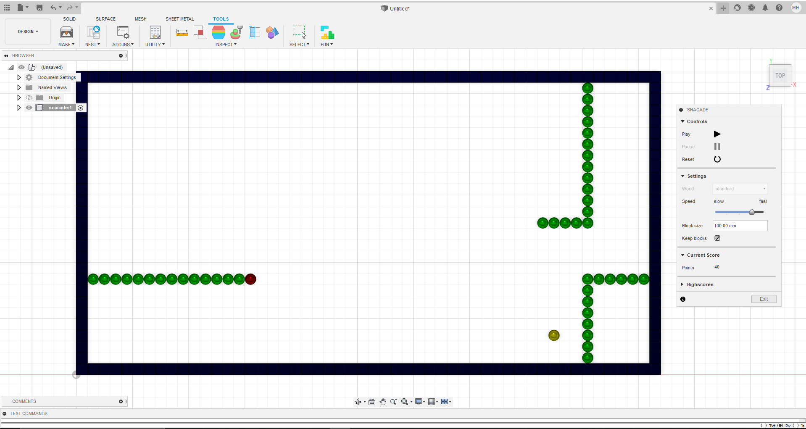

# Snacade
This addin allows you to play the famous snake game within Fusion360.
The addin was made just for fun and to showcase whats possible to achieve with Fusion360s API.
However, all the blocks and and spheres, representing the snake or the maze, are real Fusion360 bodies so you can use them in your CAD model if you like.

The button/command to start the game is created in the addins panel in the tools tab. By default its not pinned to the toolbar.

## Settings
### World
Their are different mazes/worlds to choose from. They contain different kinds of obstacles. 
Some of them have "portal" borders, some have fixed borders.
Just try them out.

### Speed
Sets how fast the snake is moving. Please note that Fusion360 is not a game engine (oviously ;)) so the movement of the snake might become jerky at higher speeds.

### Block Size
Specifies the diameter of the spheres / side length of the blocks.
This is only important if you keep the bodies and plan to use them in your CAD model somehow.

### Keep Blocks
If this option is set all the bodies you can see while playing snacade are kept
in a new component after leaving the game.

## Highscores
The best scores you achieved so far. You get one point per apple your snake ate during a game.
The speed or theselected maze is not accounted for calculating your score.